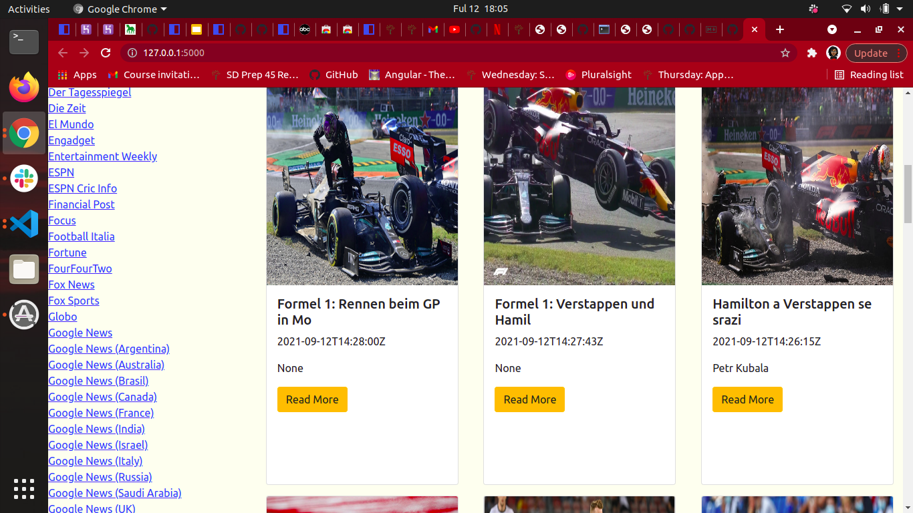
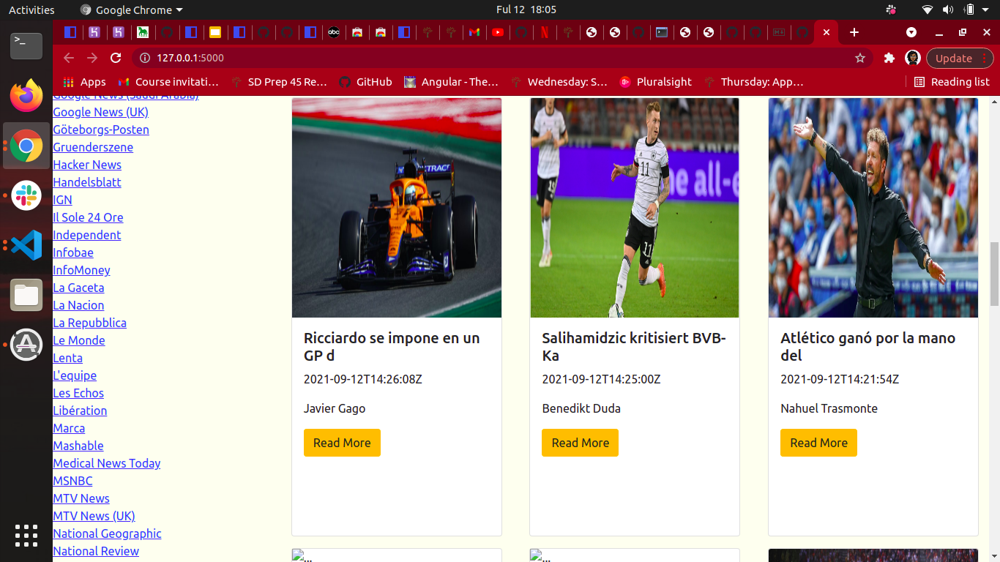

# HABARI LEO ONLINE NEWS WEBSITE
*AUTHOR* ; **TERESIA KING'ORI**
___

## Description
### The Habari leo application is an online newspaper website that provides the user with a variety of sources and categories to choose from.The Habari Leo website also provides news that is upto date.
___

## Technologies Used
* HTML
* CSS
* BOOTSTRAP
* PYTHON
* FLASK
___

## Setup Requirements
* Github
* Git
* Python3
* Flask
* Web Browser
___

## Setup Installation

* Fork/Clone the repository
* > $ git clone url
* > code   .
* > chmod a+x start.sh
* > ./start.sh
___

## Known Bugs
* No Known bugs 
___

# LICENCE 
[MIT ](https://github.com/TERESIA012/Habari_Leo/blob/master/Licence)

___

# Contacts
* Phone:+254 714 913 009
* Email:kingoriteresia@gmail.com 

___

## Screenshots

 

 

# &COPY;2021

